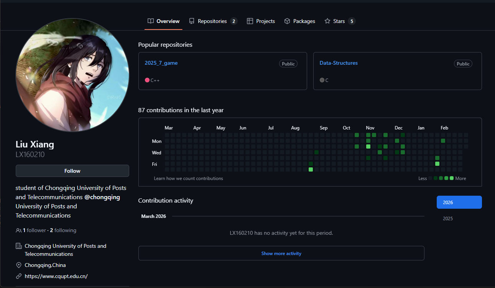

<div align="center">

# 🏢 员工登录与信息维护系统

**Employee Login & Profile Management System**


一个完整的员工账号管理与信息维护 Web 应用示例。

</div>

---

## 📑 目录

- [项目简介](#-项目简介)
- [功能特性](#-功能特性)
- [技术栈](#-技术栈)
- [项目结构](#-项目结构)
- [安装与运行](#-安装与运行)
- [使用说明](#-使用说明)
- [演示账号](#-演示账号)
- [注意事项](#-注意事项)
- [自定义与扩展](#-自定义与扩展)
- [许可](#-许可)

---

## 📖 项目简介

前端采用原生 **HTML / CSS / JavaScript**，后端使用 **Node.js + Express**，数据存储在 JSON 文件中。  
系统支持员工注册、登录、密码找回（验证码演示）、密码修改、个人信息维护，并完整记录每次信息变更的历史。



---

## ✨ 功能特性

| 功能 | 描述 |
|------|------|
| 🔐 **员工登录** | 支持工号 + 密码登录；连续输错 **5 次**后账号锁定 **5 分钟** |
| 📝 **员工注册** | 工号格式：`E` + 数字（如 `E1002`），密码至少 **6 位** |
| 🔑 **找回密码** | 通过短信或邮箱发送验证码（演示环境弹窗显示），验证后重置密码 |
| 🔒 **修改密码** | 登录后在个人中心一键修改 |
| 👤 **信息维护** | 修改手机号、邮箱、部门、岗位，每次修改均被记录 |
| 📋 **历史记录** | 展示最近 **50 条**信息变更记录 |
| 🚪 **安全退出** | 清除本地会话，安全返回登录页 |

---

## 🛠 技术栈

| 分类 | 技术 |
|------|------|
| **前端** | HTML5, CSS3, JavaScript (ES6) |
| **后端** | Node.js, Express |
| **数据存储** | JSON 文件（`data/db.json`） |
| **状态管理** | localStorage 维持登录状态 |

---

## 📁 项目结构

```
项目根目录/
├── html/                        # 前端页面
│   ├── index.html               # 首页（登录 / 注册 / 个人中心）
│   ├── selfintroduction.html    # 个人介绍页
│   ├── about.html               # 关于我们
│   └── contact.html             # 联系页面
├── css/                         # 样式文件
│   ├── style.css                # 全局样式
│   └── sistyle.css              # 个人介绍页专用样式
├── js/                          # JavaScript 脚本
│   ├── employee.js              # 员工模块逻辑（登录 / 注册 / 个人中心）
│   ├── contact.js               # 联系页面留言处理
│   └── server.js                # Node.js 后端服务入口
├── data/                        # 数据存储
│   └── db.json                  # 员工数据（账号、密码、个人信息、历史）
├── img/                         # 图片资源
│   └── github首页.png           # 示例图片
├── package.json                 # npm 配置及依赖
├── package-lock.json            # 依赖版本锁定
└── start-app.bat                # Windows 一键启动脚本
```

---

## 🚀 安装与运行

### 环境要求

- **Node.js** v12 或更高版本

### ⚡ 快速启动（Windows）

双击 `start-app.bat`，脚本将自动：

1. 检查 npm 环境
2. 安装项目依赖
3. 启动后端服务
4. 在浏览器中打开 `http://localhost:3000`

### 🖥 手动启动

```bash
# 进入项目根目录
cd your-project-folder

# 安装依赖
npm install

# 启动服务
npm start
# 服务默认运行在 http://localhost:3000
```

### 🌐 局域网访问

服务默认监听 `0.0.0.0`，同一局域网内的设备可通过以下地址访问：

```
http://你的内网IP:3000
```

---

## 📘 使用说明

1. **登录** — 使用演示账号或自行注册新账号后登录。
2. **注册** — 工号格式为 `E` + 数字（如 `E2002`），密码至少 6 位。
3. **找回密码** — 点击"忘记密码"，输入工号并选择验证方式，点击"发送验证码"后弹窗会显示验证码，输入后即可重置密码。
4. **个人中心** — 登录后可修改密码、更新个人信息，变更历史将显示在页面下方的表格中。
5. **退出** — 点击"安全退出"清除登录状态。

---

## 👤 演示账号

| 工号 | 密码 | 备注 |
|------|------|------|
| `E1001` | `111111` | 默认测试账号（以 `db.json` 中实际值为准） |
| `E3001` | `123456` | 备用测试账号 |

> 💡 如需修改密码，直接编辑 `data/db.json` 文件即可，无需重启服务。

---

## ⚠️ 注意事项

- 验证码为**演示功能**，实际不会发送短信/邮件，而是通过 `alert` 弹出。
- 账号连续输错密码 **5 次**后锁定 **5 分钟**（重启服务会重置计数）。
- 所有数据保存在 `data/db.json` 中，修改文件后**无需重启服务**即可生效。

---

## 🔧 自定义与扩展

- 修改 `server.js` 中的常量来调整锁定策略：
  - `LOCK_THRESHOLD` — 最大错误次数（默认 5）
  - `LOCK_DURATION_MS` — 锁定时长，单位毫秒（默认 5 分钟）
- 如需连接真实数据库，替换 `loadDB` / `saveDB` 的实现逻辑即可。

---

## 📄 许可

本项目仅供**学习交流**使用，无任何商业授权限制。
